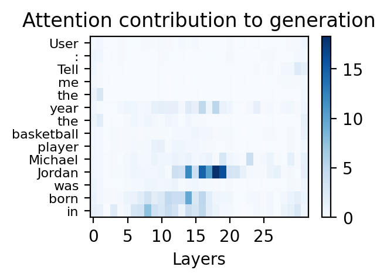
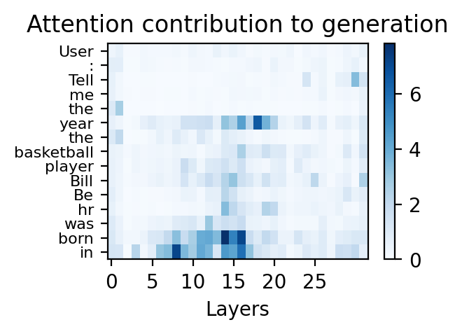
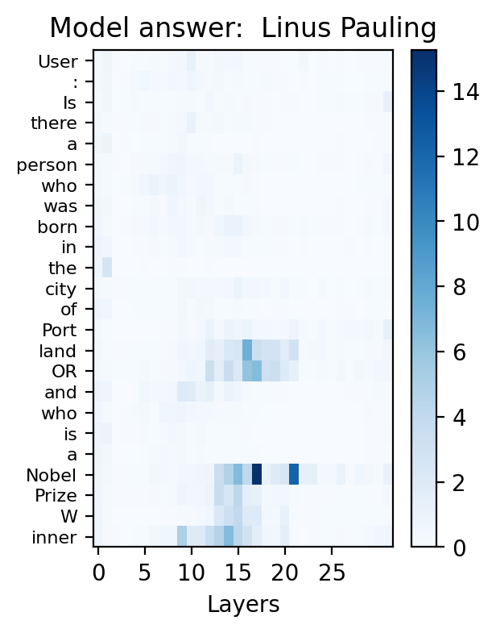

# Introduction 
Source code for the ICLR 2024 paper: Attention Satisfies: A Constraint-Satisfaction Lens on Factual Errors of Language Models; Mert Yuksekgonul, Varun Chandrasekaran, Erik Jones, Suriya Gunasekar, Ranjita Naik, Hamid Palangi, Ece Kamar, Besmira Nushi.

**Installation**:<br>
The code is written in Python 3.11, and you can use `requirements.txt` to install the required packages. 
```bash
conda create -n satprobe python=3.11
conda activate satprobe
pip install -r requirements.txt
```

## Datasets
We provide the datasets used in the paper in the `factual_queries` folder. It is as simple to load as:
```python
from factual_queries import load_constraint_data
items = load_constraint_data('basketball_players')
print(items[0])
# {'player_name': 'Michael Jordan', 'label': 1963, 'prompt': 'User: Tell me the year the basketball player Michael Jordan was born in.\nAssistant: The player was born in', ...
```

## Attention Tools
`model_lib/attention_tools.py` contains the code for collecting attention-based metrics from the Llama-2 family of models. It can be used as follows:
```python
from model_lib import HF_Llama2_Wrapper, run_attention_monitor
tokenizer = transformers.AutoTokenizer.from_pretrained("meta-llama/Llama-2-7b-hf")
model = transformers.AutoModelForCausalLM.from_pretrained("meta-llama/Llama-2-7b-hf", torch_dtype=torch.bfloat16, device_map="cuda")

model_wrapped = HF_Llama2_Wrapper(model, tokenizer, device="cuda")
prompt_info = {"prompt": "The great Michael Jordan was born in",
    "constraints": [" Michael Jordan"]}
data = run_attention_monitor(prompt_info,
                             model_wrapped)
```
This `data` object will contain the attention flow information for the given prompt and constraints. You can use this object to visualize the attention flow as follows:

```python
from viz_tools import plot_attention_flow
# Collect the attention contribution data
flow_matrix = data.all_token_contrib_norms[:, 1:data.num_prompt_tokens].T
# Get token labels 
token_labels = data.token_labels[1:data.num_prompt_tokens]
fig = plot_attention_flow(flow_matrix, token_labels)
fig
```
which would produce the following visualization:


Here is another example to see the contrast with a different prompt where the model is incorrect (notice low attention on the constraint tokens):


Here is a multi-constraint example:
```python
prompt_info = {'prompt': "User: Is there a person who was born in the city of Portland OR and who is a Nobel Prize Winner\nAssistant: Yes, the person's name is",
 'constraints': [' who is a Nobel Prize Winner',
  ' who was born in the city of Portland OR']}
data = run_attention_monitor(prompt_info,
                             model_wrapped)
                             from viz_tools import plot_attention_flow
# Collect the attention contribution data
flow_matrix = data.all_token_contrib_norms[:, 1:data.num_prompt_tokens].T
# Get token labels 
token_labels = data.token_labels[1:data.num_prompt_tokens]
fig = plot_attention_flow(flow_matrix, token_labels, topk_prefix=24, figsize=(3, 4), title=f"Model answer: {data['completion'].split('.')[0]}")
```

And here is the visualization:



### Detecting Factual Errors
Our probing experiments have 2 main steps:
- Collect attention-based metrics for a given dataset. This is done using the `main_flow_collection.py`.
- Train a simple linear probe on the collected metrics. This is done using the `main_probe.py`.

An example of how to use these scripts is as follows:
```bash
python main_flow_collection.py --dataset_name basketball_players --model_name meta-llama/Llama-2-7b-hf --output_dir ./outputs
python main_probe.py --dataset_name basketball_players --model_name meta-llama/Llama-2-7b-hf --output_dir ./outputs
```
which would save the resulting figures and probe results in the `./outputs` folder.

# Contact
Mert Yuksekgonul (merty@stanford.edu)
Besmira Nushi (besmira.nushi@microsoft.com)

# Citation
If you find this repository or the ideas therein useful, please consider citing our paper:
```
@inproceedings{
yuksekgonul2024attention,
title={Attention Satisfies: A Constraint-Satisfaction Lens on Factual Errors of Language Models},
author={Mert Yuksekgonul and Varun Chandrasekaran and Erik Jones and Suriya Gunasekar and Ranjita Naik and Hamid Palangi and Ece Kamar and Besmira Nushi},
booktitle={The Twelfth International Conference on Learning Representations},
year={2024},
url={https://openreview.net/forum?id=gfFVATffPd}
}
```

# Contributing
This project welcomes contributions and suggestions. Most contributions require you to agree to a Contributor License Agreement (CLA) declaring that you have the right to, and actually do, grant us the rights to use your contribution. For details, visit https://cla.opensource.microsoft.com.

When you submit a pull request, a CLA bot will automatically determine whether you need to provide a CLA and decorate the PR appropriately (e.g., status check, comment). Simply follow the instructions provided by the bot. You will only need to do this once across all repos using our CLA.

This project has adopted the Microsoft Open Source Code of Conduct. For more information see the Code of Conduct FAQ or contact opencode@microsoft.com with any additional questions or comments.

## Trademarks

This project may contain trademarks or logos for projects, products, or services. Authorized use of Microsoft 
trademarks or logos is subject to and must follow 
[Microsoft's Trademark & Brand Guidelines](https://www.microsoft.com/en-us/legal/intellectualproperty/trademarks/usage/general).
Use of Microsoft trademarks or logos in modified versions of this project must not cause confusion or imply Microsoft sponsorship.
Any use of third-party trademarks or logos are subject to those third-party's policies.